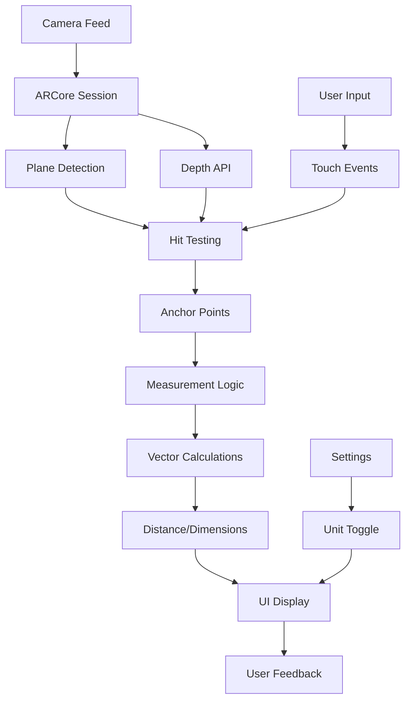

# True Scale 📏🎯

[](LICENSE)
[](https://developer.android.com)
[](https://developers.google.com/ar)


**True Scale** is a free, open-source Android AR measurement app that provides high-accuracy distance and dimension measurements using your device's camera. Built with ARCore and designed for simplicity, it's a privacy-focused alternative to proprietary measurement apps.

## ✨ Features

- **Real-time AR Measurements**: Measure distances, heights, and object dimensions
- **High Accuracy**: Sub-centimeter precision using ARCore Depth API
- **Privacy First**: 100% offline, no data collection
- **Unit Support**: Toggle between metric (cm/m) and imperial (inches/feet)
- **Beginner-Friendly**: Clean, documented code for easy contributions
- **Material Design 3**: Modern, accessible UI

## 📱 Requirements

- Android 9.0 (API level 28) or higher
- ARCore-compatible device ([Check compatibility](https://developers.google.com/ar/devices))
- Camera permission

## 🚀 Quick Start

### Prerequisites

1. **Install Android Studio** (Arctic Fox 2020.3.1 or newer)
2. **Install Git** for version control
3. **Enable Developer Options** on your Android device

### Repository Setup

```bash
# Clone the repository
git clone https://github.com/yourusername/true-scale.git
cd true-scale

# Initialize git (if starting fresh)
git init
git add .
git commit -m "Initial commit: True Scale AR measurement app"

# Create and push to GitHub
git remote add origin https://github.com/yourusername/true-scale.git
git branch -M main
git push -u origin main
```

### Build Instructions

1. Open the project in Android Studio
2. Let Gradle sync (may take a few minutes first time)
3. Connect your Android device via USB
4. Click "Run" (green play button) or use:

```bash
# Build from command line
./gradlew assembleDebug

# Install on connected device
./gradlew installDebug
```

## 🏗️ Project Structure

```
true-scale/
├── app/
│   ├── src/
│   │   ├── main/
│   │   │   ├── java/com/truescale/app/
│   │   │   │   ├── MainActivity.kt          # Main AR activity
│   │   │   │   ├── MeasurementFragment.kt   # Measurement UI
│   │   │   │   ├── ar/
│   │   │   │   │   ├── ArMeasurementManager.kt  # AR session management
│   │   │   │   │   └── MeasurementRenderer.kt   # 3D rendering
│   │   │   │   ├── utils/
│   │   │   │   │   ├── MeasurementUtils.kt      # Distance calculations
│   │   │   │   │   ├── Vector3.kt               # 3D vector math
│   │   │   │   │   └── Units.kt                 # Unit conversions
│   │   │   │   └── viewmodel/
│   │   │   │       └── MeasurementViewModel.kt  # MVVM architecture
│   │   │   ├── res/
│   │   │   │   ├── layout/                  # UI layouts
│   │   │   │   ├── values/                  # Strings, colors, themes
│   │   │   │   └── drawable/                # Icons and graphics
│   │   │   └── AndroidManifest.xml          # App configuration
│   │   └── test/                            # Unit tests
│   └── build.gradle.kts                     # App-level dependencies
├── build.gradle.kts                          # Project-level config
├── settings.gradle.kts                       # Project settings
├── .github/
│   └── workflows/
│       └── android-ci.yml                   # CI/CD pipeline
├── README.md                                 # This file
├── LICENSE                                   # MIT License
└── .gitignore                               # Git ignore rules
```

## 🔧 Configuration

### Gradle Dependencies (app/build.gradle.kts)

```kotlin
dependencies {
    implementation("com.google.ar:core:1.41.0")        // ARCore
    implementation("androidx.core:core-ktx:1.12.0")    // Kotlin extensions
    implementation("androidx.lifecycle:lifecycle-viewmodel-ktx:2.7.0")
    implementation("androidx.fragment:fragment-ktx:1.6.2")
    implementation("com.google.android.material:material:1.11.0")
}
```

## 📐 High-Level Architecture



### Component Explanation

1. **Camera Feed**: Live camera input for AR processing
2. **ARCore Session**: Manages AR tracking and environment understanding
3. **Plane Detection**: Identifies surfaces (floors, walls, tables)
4. **Depth API**: Provides accurate depth information for measurements
5. **Hit Testing**: Determines 3D points from screen touches
6. **Measurement Logic**: Calculates distances using 3D vector math
7. **UI Layer**: Displays results and handles user interaction

## 🎯 Accuracy Implementation

True Scale achieves high accuracy through:

1. **ARCore Depth API**: Hardware-accelerated depth sensing on supported devices
2. **Multiple Anchor Points**: Stabilizes measurements across frames
3. **Confidence Indicators**: Shows measurement stability
4. **Calibration**: Automatic environment calibration
5. **Error Correction**: Filters outliers and smooths results

### Accuracy Tips

- Hold device steady for 2-3 seconds before measuring
- Ensure good lighting (avoid very dark environments)
- Move device slowly to scan environment
- Use on textured surfaces (avoid plain white walls)

## 🧪 Testing

### Unit Tests
```bash
./gradlew test
```

### Instrumented Tests (requires device/emulator)
```bash
./gradlew connectedAndroidTest
```

### Manual Testing Checklist
- [ ] App launches without crashes
- [ ] Camera permission requested and handled
- [ ] AR planes detected on surfaces
- [ ] Touch to place measurement points works
- [ ] Distance calculations are accurate (±2cm)
- [ ] Unit toggle functions correctly
- [ ] UI responds to device rotation

## 🤝 Contributing

We welcome contributions! Please follow these steps:

1. Fork the repository
2. Create a feature branch (`git checkout -b feature/AmazingFeature`)
3. Make your changes with clear commits
4. Add/update tests as needed
5. Update documentation
6. Push to your branch (`git push origin feature/AmazingFeature`)
7. Open a Pull Request

### Code Style

- Follow Kotlin coding conventions
- Add comments for complex logic
- Keep functions small and focused
- Use meaningful variable names

## 📊 Performance Optimization

- **Target**: 30+ FPS on mid-range devices
- **Memory**: < 150MB RAM usage
- **Battery**: Optimized AR processing to minimize drain
- **Fallback**: Basic camera mode for non-ARCore devices

## 🔐 Privacy & Security

- **No Data Collection**: Zero telemetry or analytics
- **Offline Only**: No internet permission required
- **Camera Access**: Used only during active measurement
- **Open Source**: Full code transparency

## 🐛 Troubleshooting

### Common Issues

**Issue**: "ARCore not supported"
- **Solution**: Check device compatibility at https://developers.google.com/ar/devices

**Issue**: Measurements seem inaccurate
- **Solution**: Ensure good lighting and move device to scan environment thoroughly

**Issue**: App crashes on launch
- **Solution**: Update ARCore from Google Play Store

## 📱 Icon Concept

The app icon features a minimal design:
- **Primary Element**: Ruler/measuring tape silhouette
- **Secondary Element**: AR crosshair overlay
- **Colors**: Material You dynamic theming or blue gradient
- **Style**: Flat, modern, geometric

## 🚦 Implementation Phases

### Phase 1: Project Setup ✅
- Initialize Android project
- Configure ARCore dependencies
- Set up basic UI structure

### Phase 2: AR Integration 🔄
- Implement AR session management
- Add plane detection
- Enable camera feed display

### Phase 3: Measurement Logic 🔄
- Implement touch-to-measure
- Add vector calculations
- Display distance results

### Phase 4: Accuracy Enhancement 🔄
- Integrate Depth API
- Add confidence indicators
- Implement smoothing algorithms

### Phase 5: Polish & Deploy 🔄
- Refine UI/UX
- Add accessibility features
- Prepare for release

## 📄 License

This project is licensed under the MIT License - see the [LICENSE](LICENSE) file for details.

## 🙏 Acknowledgments

- ARCore team at Google for the excellent AR framework
- Material Design team for UI guidelines
- Open-source community for inspiration and support

## 📞 Support

- **Issues**: [GitHub Issues](https://github.com/yourusername/true-scale/issues)
- **Discussions**: [GitHub Discussions](https://github.com/yourusername/true-scale/discussions)
- **Email**: truescale.app@example.com

---

**Made with ❤️ for the open-source community**